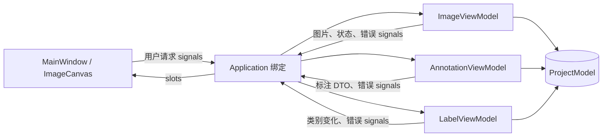
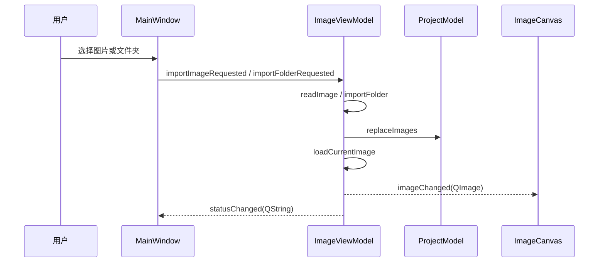
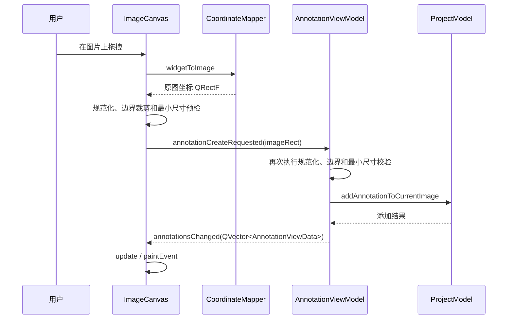
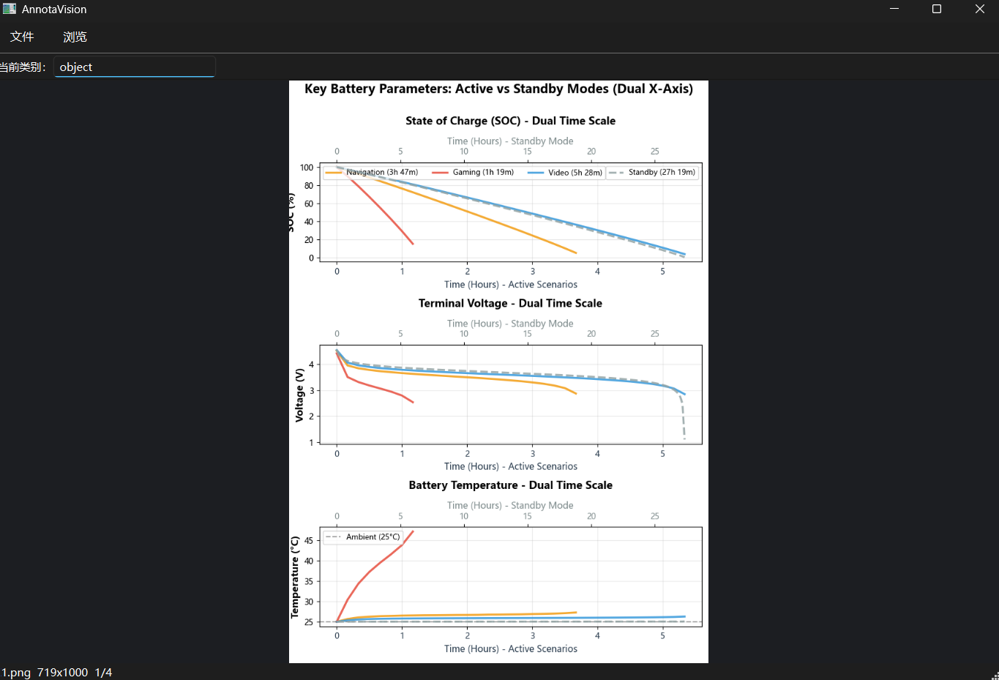
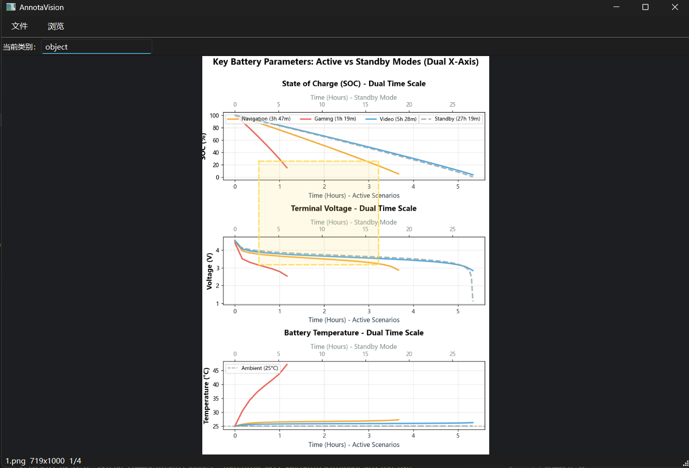
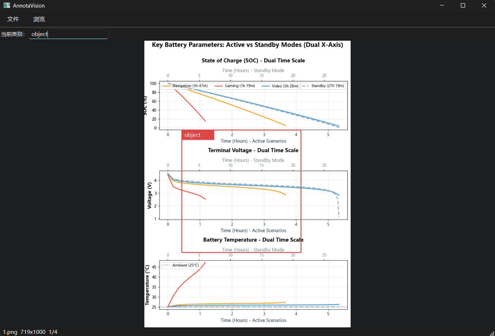
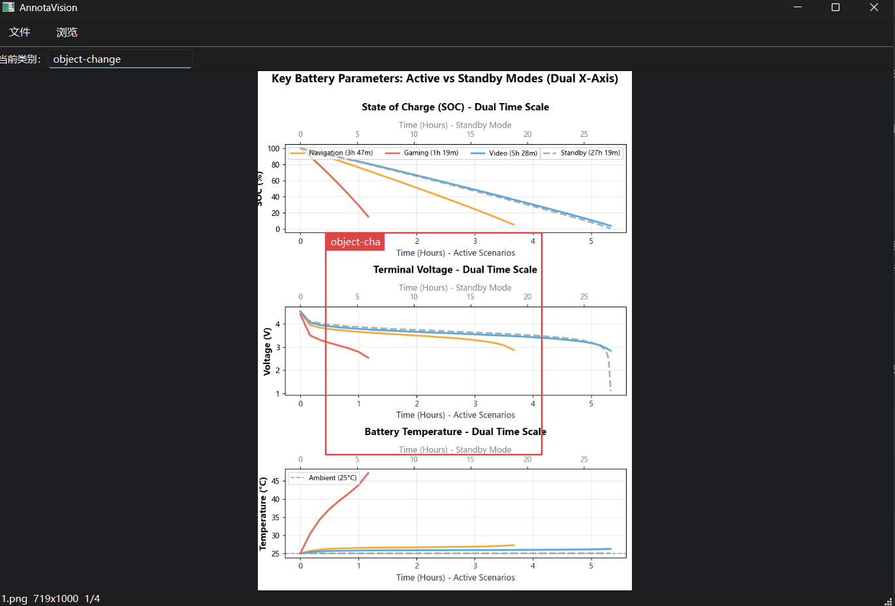

# PixelTagger 阶段性开发中期实验报告

> 开发模式：以人为主、智能体辅助  
> 技术栈：C++17、Qt Widgets、CMake、vcpkg  
> 报告日期：2026 年 7 月 14 日
> 小组成员：张程龄 3240104064，朱珂晗 3240100550 ，倪泠 3240103700

## 一、项目概述

PixelTagger 是一个轻量级图像标注与处理系统。本阶段以建立可持续迭代的软件结构为主要目标，在完成图片浏览闭环的基础上，实现了单类别矩形框标注 MVP，并使用适合 Qt Widgets 的 MVVM 架构明确界面、业务和数据之间的边界。

当前已经实现：

- 打开单张图片；
- 扫描并打开图片文件夹；
- 使用键盘或菜单切换上一张、下一张图片；
- 图片保持宽高比并居中显示；
- 在画布上拖拽创建矩形标注；
- 在窗口缩放时保持标注与原图位置一致；
- 编辑当前类别名称，并同步刷新已有标注的显示文字；
- 维护图片、类别、标注 ID 以及项目修改状态；
- 使用 `Application` 组合根集中管理对象生命周期与信号绑定。

本阶段尚未实现标注保存、标注选择与删除、撤销重做、多类别管理和标注格式导出。这些内容将作为后续迭代目标。

## 二、团队成员与阶段分工


| 成员   | 主要工作                                                                                       | 对应提交                        |
| ------ | ---------------------------------------------------------------------------------------------- | ------------------------------- |
| 张程龄 | 初始化项目；实现矩形标注 MVP；引入 `Application` 组合根并重构 MVVM 边界                        | `b093871`、`9c1e189`、`c52cb21` |
| 朱珂晗 | 探索 Command 架构；解决 MSVC 在中文 Windows 环境下读取 UTF-8 源码的问题                        | `6081e02`、`3317576`            |
| 倪泠   | 复核图片导入层级，移除当前阶段粒度过细的 `ImageImportService`，将导入职责收回 `ImageViewModel` | `f32c71f`                       |

团队采用逐步演化的方式开发：先建立最小可运行闭环，随后引入 Command 架构，再加入矩形标注和 Application 管理模块，最后根据实际复杂度重构对象装配和模块边界。整个迭代过程反映了小组成员对不同功能规模下模块架构的理解不断深入。

## 三、当前架构与整体流程

### 3.1 MVVM 的落地方式

本项目采用 Qt signals/slots 驱动的显式 MVVM：

- **Model** 保存唯一的业务数据，并通过受控方法维护 ID、实体关系和修改状态；
- **View** 负责菜单、工具栏、绘制、鼠标交互以及依赖显示状态的坐标转换；
- **ViewModel** 接收界面意图，执行业务规则，修改 Model，并生成适合 View 使用的展示数据；
- **Application** 创建所有主要对象，注入共享的 `ProjectModel`，并集中建立信号槽连接。



`Application` 只承担装配职责，不读取图片、不校验标注，也不绘制界面。这样既避免 `MainWindow` 直接持有 ViewModel，也避免各个 ViewModel 直接依赖彼此。

### 3.2 图片导入与显示流程



图片元数据保存在 `ImageModel` 中，当前显示所需的像素数据由 `ImageViewModel` 保存为 `QImage`。打开文件夹时先读取图片信息，切换到具体图片时再加载像素，避免一次性长期保存整个文件夹的像素数据。

### 3.3 矩形标注流程



Model 中的标注永远使用原图坐标。Canvas 在接收鼠标输入时将窗口坐标转换为原图坐标，在绘制时再将原图坐标转换回当前窗口坐标。因此调整窗口尺寸不会改变标注在图片中的实际位置。


## 四、技术难点及解决过程

### 1. MVVM 架构不能流于形式

项目早期最大的技术难点不是某个具体 API 的使用，而是如何避免 Qt Widgets 项目退化成“所有逻辑都写在 `MainWindow` 里”。Qt 的信号槽在缺少边界约束情况下，菜单事件、图片加载、标注创建、类别修改等逻辑很容易集中到窗口类中，导致后续维护困难。

为解决这一问题，团队将系统职责重新拆分：

- `View` 只负责界面展示、用户输入和绘制。
- `ViewModel` 负责业务操作、状态更新和展示数据生成。
- `Model` 作为唯一真实业务数据源，保存图片、类别和标注数据。
- `Application` 作为组合根，负责创建对象并建立信号槽连接。

这一调整使 `MainWindow` 不再直接持有 `ProjectModel` 或执行业务修改，而是通过信号表达用户意图。例如，打开图片时，`MainWindow` 发出导入请求，由 `ImageViewModel` 处理；拖拽标注时，`ImageCanvas` 发出创建请求，由 `AnnotationViewModel` 修改模型。这样既保留了 Qt 信号槽的便利，又避免了业务逻辑侵入界面层。

### 2. 图片坐标与界面坐标的转换

图像标注工具的核心难点之一是坐标系统。用户看到的是经过缩放、居中显示后的图片，鼠标事件发生在 Widget 坐标系中，而真正需要保存和导出的标注框必须是原始图像坐标。如果直接保存屏幕坐标，窗口大小变化、图片缩放、导出 YOLO 格式时都会产生错误。

团队将坐标问题拆分为两层：

- `ImageCanvas` 管理当前图片显示区域、拖拽状态和临时预览框。
- `CoordinateMapper` 专门负责 Widget 坐标与 Image 坐标的转换。

当前标注流程为：

```text
鼠标拖拽产生 Widget 坐标
  -> CoordinateMapper 转换为 Image 坐标
  -> ImageCanvas 发出 annotationCreateRequested(imageRect)
  -> AnnotationViewModel 校验并写入 ProjectModel
```

通过这一设计，`AnnotationModel` 中只保存原图坐标，Canvas 绘制时再转换回界面坐标。这样窗口缩放后标注框仍能贴合图片位置，也为后续缩放、平移和 YOLO 导出保留了正确基础。

### 3. ProjectModel 作为唯一业务数据源

在设计标注数据结构时，曾考虑过使用图片绝对路径作为 `QMap` 的 key 来保存标注。这样做在早期实现上较简单，但会带来迁移困难、JSON 保存不稳定、跨平台路径不一致等问题。

经过讨论后，团队改为让 `ImageModel` 自身拥有对应的 `AnnotationModel` 集合：

```text
ProjectModel
├── ImageModel[]
│   └── AnnotationModel[]
└── LabelModel[]
```

这样标注天然属于图片，不再依赖绝对路径作为业务主键。图片路径仍可用于运行时加载，但不作为长期数据结构的核心索引。该设计更适合后续项目保存、数据集导出和多人协作。

### 4. 当前类别命名的交互细节

当前阶段只实现一个类别，但仍需要允许用户修改类别名称。最初曾考虑通过菜单设置类别名，但这会导致用户在标注时看不到当前类别。最终团队选择在工具栏中放置可编辑下拉框：

```text
当前类别：[ object ▼ ]
```

这个方案的优势是当前类别始终可见，用户在连续画框时不会忘记正在使用的类别。

实现过程中还遇到一个细节问题：如果直接监听 `editTextChanged`，用户从 `object` 改成 `Person` 时，删除旧文本的中间过程会出现空值，从而触发“类别不能为空”的提示。为改善体验，团队将类别修改改为提交式：

- 编辑过程中允许临时为空。
- 按回车、失焦或选择下拉项时才提交。
- 提交为空时恢复上一次有效类别。

该问题体现出界面交互不能只考虑数据合法性，也要考虑用户输入过程本身。

### 5. Qt 构建与运行环境问题

项目使用 CMake 管理构建，并基于 Qt Widgets 开发。实际配置中遇到过 Qt CMake 包路径、MSVC 工具链、运行时 DLL 部署等问题。例如，程序构建成功后，如果运行目录缺少 Qt 平台插件，启动时可能没有窗口或直接退出。

团队通过以下方式解决：

- 在 README 中使用 `<QtPrefix>` 和 `VCPKG_ROOT` 等通用占位说明，避免写入本机绝对路径。
- 使用 CMake preset 统一 VS2022 构建入口。
- 必要时通过 `windeployqt` 部署 Qt 运行时依赖。
- 对 README 和文档进行敏感路径扫描，确保适合上传 GitHub。

这些工作虽然不直接体现为界面功能，但保证了项目的可复现性和提交安全性。


## 五、团队协作情况

### 5.1 协作亮点

1. **基于 MVVM 边界分工，并通过稳定接口完成并行协作。** 团队没有按照“每人随意修改一部分代码”的方式推进，而是围绕 Model、View、ViewModel 和 Application 的职责划分任务：图片、标注和类别分别由对应 ViewModel 处理，`ProjectModel` 维护唯一业务数据，`ImageCanvas` 负责绘制和坐标交互，`Application` 统一完成对象创建与信号绑定。模块之间主要通过 `importImageRequested`、`annotationCreateRequested`、`currentImageChanged`、`labelsChanged` 和 `annotationsChanged` 等强类型信号交换信息。这样成员可以分别开发界面、业务和数据模块，只要共同约定信号参数和 Model 公共接口，就能减少对其他成员内部实现的依赖。例如图片切换功能只需发出 `currentImageChanged()`，标注模块即可独立响应并刷新当前图片的标注，不需要让 `ImageViewModel` 直接持有 `AnnotationViewModel`。

2. **利用 Git 保留方案演化过程，并通过评审及时调整不合适的抽象。** 项目提交历史体现了“实现—验证—重构”的协作过程：建立项目骨架和矩形标注 MVP，探索 Command 架构并解决 UTF-8 构建问题；根据实际功能规模移除了没有足够复用价值的函数和接口，三个架构同时并行。团队没有因为某个方案已经完成就机械保留，而是借助独立提交、分支和代码差异比较保留讨论依据，再由成员共同决定最终结构。使功能提交、构建修复和重构提交能够被单独审查、回退和复用。


### 5.2 可改进之处

1. **先讨论跨模块接口。** Command 引入后很快在老师指导下被Application方案替换，说明在编码前可以增加一次短时间的架构评审，明确是采用 Command 还是 Qt signal 作为 View 请求入口。
2. **补充自动化测试。** 当前缺少 `ProjectModel`、`CoordinateMapper` 和 ViewModel 的单元测试，重构主要依赖人工运行验证。
3. **减少集成文件冲突。** 新功能经常需要修改 `Application.cpp` 和 `CMakeLists.txt`。可以指定集成人员，或把绑定拆为 `bindImageFlow()`、`bindAnnotationFlow()` 等小函数。

4. **建立代码评审清单。** 特别检查层间依赖、对象所有权、坐标语义、信号参数和错误处理，避免不同成员形成隐含且不一致的假设。

## 六、阶段性成果展示

### 6.1 架构成果

本阶段已经形成“单一 Model + 多个并列 ViewModel + Application root”的可扩展结构。图片切换会自动触发标注刷新，类别修改会自动触发标注展示数据重新生成，证明跨模块通知闭环已经建立。

### 6.2 功能效果截图

以下截图展示当前阶段的实际运行效果。

#### 图 1：主界面与图片导入



#### 图 2：矩形框拖拽预览



#### 图 3：标注创建结果



#### 图 4：类别名称修改结果



### 6.3 当前结果评估

当前版本已经证明以下关键路径可行：

- Qt Widgets 中可以通过显式 MVVM 保持界面与业务解耦；
- 标注可以稳定保存为原图坐标并在不同窗口尺寸下正确绘制；
- 图片、标注和类别三个 ViewModel 可以围绕同一个 ProjectModel 协作；
- Application 能够作为稳定的对象装配入口；
- 项目能够在 Visual Studio 2022、CMake、Qt 和 vcpkg 环境中完成配置与构建。

## 七、智能体的使用

### 7.1 使用方式

本阶段将智能体作为辅助工具，主要应用于：

- 阅读目录与代码，梳理 MVVM 调用链；
- 解释 Qt signals/slots、参数传递和对象生命周期；
- 提出 Command 架构原型并协助修改文档；
- 分析编译错误、中文编码问题和跨文件依赖；
- 根据API文档填充函数具体实现和QT框架调用；


### 7.2 实际效果

智能体提高了代码阅读、问题定位和文档整理的速度，尤其适合完成跨文件调用链追踪、构建错误分析和方案对比。团队成员仍需结合项目规模和 Qt 特性作出最终选择，例如后续人工决定使用 `Application + signals/slots` 取代早期 Command 方案，并移除当前阶段不必要的导入 Service。

### 7.3 存在的问题

- 智能体可能倾向于引入形式完整但当前并不必要的抽象，产生过度设计；
- 智能体生成的代码仍需通过编译、运行和代码评审验证；
- 当多轮对话跨越不同分支时，需要明确当前分支和工作区状态，避免基于旧代码提出建议；

因此，本项目坚持“人提出目标并作出决策，智能体提供工具辅助，并审核智能体的代码结果的开发模式。

## 八、总体心得与个人感悟

### 8.1 总体心得

本阶段最大的收获不是单独完成一个矩形框，而是建立了一条从鼠标输入、坐标转换、业务校验、Model 更新到界面重绘的完整闭环。开发过程表明，MVVM 的价值不在目录名称，而在于是否真正控制了依赖方向：View 不修改 Model，ViewModel 不绘制界面，Model 不发起 UI 操作，Application 不承载业务逻辑。

团队也认识到，架构设计需要随着实际需求逐步演化。Command、Service 等模式并非越多越好；当它们没有解决当前真实变化点时，及时简化比机械保留更有价值。同时，构建环境、源码编码、Git 分支和文档约定也是团队工程能力的一部分，不能只关注功能代码。


### 8.2 成员个人感悟


#### 张程龄

本阶段主要参与了项目骨架、矩形标注闭环和 Application 装配层的实现。通过实际开发，让我对 MVVM 的理解从“目录上的分层”逐渐转向“行为上的分层”。一开始，我只建了 Model、View、ViewModel目录，但真正开发图片导入、矩形标注和类别命名功能后，我发现仅有目录结构并不能保证架构清晰。如果 View 为了方便直接修改数据，或者 MainWindow 承担过多业务转发，MVVM 很快就会变成形式上的分层。
后续我们不断把架构边界收紧。解除了对特定 View/MainWindow 的强绑定。并在老师的指导下，在通知机制上引入统一枚举通知和 getter 拉取数据，减少大对象通过信号传递，也避免信号接口随着数据类型增加而膨胀。
这个过程让我意识到，架构不是一开始设计完就固定不变的，而是在功能推进中不断发现职责外溢，再把逻辑拉回正确层次的过程。严格的 MVVM 并不是为了增加复杂度，而是为了让每个模块只承担自己的责任。这样后续继续增加保存、导出、多类别管理和撤销重做时，项目才不会因为早期边界混乱而难以维护。


#### 朱珂晗

本阶段主要探索了统一 Command 接口，并处理了 MSVC 中文源码的 UTF-8 编译问题。Command 方案后来被 Qt signals/slots 和 Application 组合根取代，但这一过程让我认识到设计模式需要结合框架特性和项目规模选择，而不是仅追求形式统一。同时，对于框架的理解也在项目实现中一步步加深，在多次的项目架构调整和具体功能实现的分工中也更加知道了MVVM架构的好处。

#### 倪泠

本阶段主要围绕图片导入模块做了代码阅读和架构复核，并移除了当前阶段独立的 ImageImportService。由于该 Service 只包了一层图片读取和目录扫描逻辑，既没有被多个模块复用，也没有隔离复杂外部依赖，反而让导入调用链变长，因此把导入职责收回 ImageViewModel，更符合“用户请求由对应 ViewModel 处理”的分层规则。使用智能体不能只看它是否能生成可编译代码，还要结合调用链、职责边界和后续变化点判断它生成的抽象是否必要。对于没有明确复用价值、反而增加理解成本的代码，应当及时移除。

## 九、下一阶段计划

1. 为 `ProjectModel`、`CoordinateMapper` 和三个 ViewModel 增加单元测试；
2. 实现标注选择、删除、移动和缩放；
3. 引入撤销/重做，并在该需求下重新评估 Command 模式；
4. 增加多个类别的创建、选择和颜色管理；
5. 实现项目保存与加载，优先支持 JSON；
6. 增加 YOLO 或 COCO 标注格式导出；


## 十、结论

本阶段完成了从图片浏览器骨架到矩形标注工具 MVP 的演进，并建立了较清晰的 Qt MVVM 分层。团队通过多轮实现和重构解决了坐标映射、数据封装、对象装配、中文编码和抽象层级等问题。智能体在代码理解、环境配置、错误定位和文档生成方面提供了有效辅助，但关键架构取舍仍由团队成员结合实际需求完成，符合“以人为主、智能体辅助”的开发原则。
