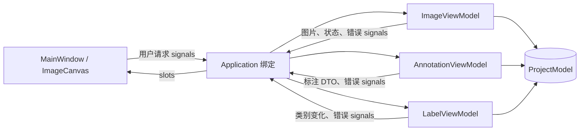
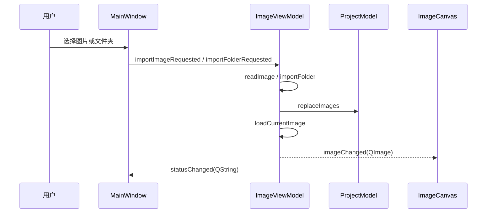
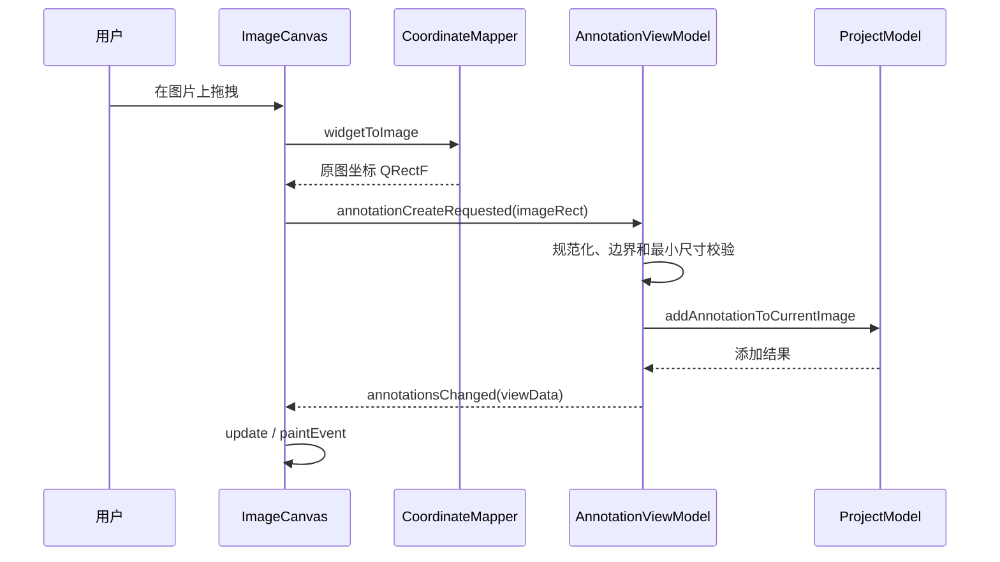

# AnnotaVision 阶段性开发中期实验报告

> 开发模式：以人为主、智能体辅助  
> 技术栈：C++17、Qt Widgets、CMake、vcpkg  
> 报告日期：2026 年 7 月 14 日

## 一、项目概述

AnnotaVision 是一个轻量级图像标注与处理系统。本阶段以建立可持续迭代的软件结构为主要目标，在完成图片浏览闭环的基础上，实现了单类别矩形框标注 MVP，并使用适合 Qt Widgets 的 MVVM 架构明确界面、业务和数据之间的边界。

当前已经实现：

- 打开单张图片；
- 扫描并打开图片文件夹；
- 使用键盘或菜单切换上一张、下一张图片；
- 图片保持宽高比并居中显示；
- 在画布上拖拽创建矩形标注；
- 在窗口缩放时保持标注与原图位置一致；
- 编辑当前类别名称，并同步刷新已有标注的显示文字；
- 维护图片、类别、标注 ID 以及项目修改状态；
- 使用 `Application` 组合根集中管理对象生命周期与信号绑定。

本阶段尚未实现标注保存、标注选择与删除、撤销重做、多类别管理和标注格式导出。这些内容将作为后续迭代目标。

## 二、团队成员与阶段分工

以下分工依据 Git 提交记录整理，姓名或职责描述可由成员在提交报告前补充确认。

| 成员（Git 作者） | 主要工作                                                                                       | 对应提交                        |
| ---------------- | ---------------------------------------------------------------------------------------------- | ------------------------------- |
| `serein6174`     | 初始化项目；实现矩形标注 MVP；引入 `Application` 组合根并重构 MVVM 边界                        | `b093871`、`9c1e189`、`c52cb21` |
| `kkkkh-kh`       | 探索 Command 架构；解决 MSVC 在中文 Windows 环境下读取 UTF-8 源码的问题                        | `6081e02`、`3317576`            |
| Ling Ni          | 复核图片导入层级，移除当前阶段粒度过细的 `ImageImportService`，将导入职责收回 `ImageViewModel` | `f32c71f`                       |

团队采用逐步演化的方式开发：先建立最小可运行闭环，再加入矩形标注，随后根据实际复杂度重构对象装配和模块边界。部分早期方案虽然没有保留到当前代码中，但为后续架构选择提供了对照和验证依据。

## 三、当前架构与整体流程

### 3.1 MVVM 的落地方式

本项目采用 Qt signals/slots 驱动的显式 MVVM：

- **Model** 保存唯一、真实的业务数据，并通过受控方法维护 ID、实体关系和修改状态；
- **View** 负责菜单、工具栏、绘制、鼠标交互以及依赖显示状态的坐标转换；
- **ViewModel** 接收界面意图，执行业务规则，修改 Model，并生成适合 View 使用的展示数据；
- **Application** 创建所有主要对象，注入共享的 `ProjectModel`，并集中建立信号槽连接。



`Application` 只承担装配职责，不读取图片、不校验标注，也不绘制界面。这样既避免 `MainWindow` 直接持有 ViewModel，也避免各个 ViewModel 直接依赖彼此。

### 3.2 图片导入与显示流程



图片元数据保存在 `ImageModel` 中，当前显示所需的像素数据由 `ImageViewModel` 保存为 `QImage`。打开文件夹时先读取图片信息，切换到具体图片时再加载像素，避免一次性长期保存整个文件夹的像素数据。

### 3.3 矩形标注流程



Model 中的标注永远使用原图坐标。Canvas 在接收鼠标输入时将窗口坐标转换为原图坐标，在绘制时再将原图坐标转换回当前窗口坐标。因此调整窗口尺寸不会改变标注在图片中的实际位置。

### 3.4 类别修改流程

```text
MainWindow 编辑类别名称
  -> LabelViewModel::setCurrentLabelName()
  -> ProjectModel::renameDefaultLabel()
  -> labelsChanged()
  -> AnnotationViewModel::onLabelsChanged()
  -> 重新生成 AnnotationViewData
  -> ImageCanvas 刷新类别文字
```

`AnnotationModel` 只保存 `labelId`，类别名称和颜色由 `LabelModel` 保存。`AnnotationViewModel` 将两者组合成 `AnnotationViewData`，避免 View 直接读取和关联业务实体。

## 四、技术难点及解决过程

### 4.1 缩放显示下的标注坐标一致性

**问题：** 图片在 Canvas 中会保持比例缩放并居中。如果直接保存鼠标的窗口坐标，窗口缩放后标注框会偏离原目标，数据也无法用于后续标注导出。

**解决：** 单独实现 `CoordinateMapper`，维护原图尺寸和图片在控件中的实际显示区域，提供窗口坐标与原图坐标的双向转换。Model 只保存原图坐标，绘制阶段再转换为窗口坐标。

**协作效果：** View 与 Model 的坐标语义得到统一，后续开发保存、导出、缩放和平移功能时可以继续复用这一约定。

### 4.2 Qt Widgets 中 MVVM 的显式绑定

**问题：** Qt Widgets 不提供与 WPF 完全相同的自动 Binding。如果让 `MainWindow` 直接创建并调用所有 ViewModel，界面层会逐渐掌握业务对象的生命周期和实现细节。

**解决：** 引入 `Application` 组合根。它创建唯一 `ProjectModel`、三个并列 ViewModel 和 MainWindow，并通过 `bindView()`、`bindViewModels()` 集中连接信号槽。

**结果：** MainWindow 只发出用户意图；ViewModel 不包含具体 View；不同 ViewModel 通过事件协作，减少了源码级相互依赖。

### 4.3 Model 数据封装与只读访问

**问题：** 初始版本中图片列表和当前索引是公开属性，外部可以绕过业务规则直接修改，难以统一维护实体 ID、标注关系和 dirty 状态。

**解决：** 将 `ProjectModel` 数据成员私有化，通过 `replaceImages()`、`moveNextImage()`、`addAnnotationToCurrentImage()` 等方法进行受控更新；只读查询使用 `const ImageModel*`、`const LabelModel*` 或值返回。

**结果：** 所有修改集中经过 Model 的业务接口，数据一致性更容易检查和测试。

### 4.4 中文源码在 MSVC 下的编码错误

**问题：** 中文 Windows 上 MSVC 默认按代码页 936 读取 UTF-8 源文件，曾出现 `C4819`、字符串常量换行和宏展开异常。

**解决：** 在 CMake 中针对 MSVC 添加：

```cmake
if(MSVC)
    target_compile_options(AnnotaVision PRIVATE /utf-8)
endif()
```

**结果：** 编译器明确按 UTF-8 解析源文件，中文界面文字能够稳定编译。

### 4.5 抽象层级的取舍

**问题：** 团队先后尝试过通用 Command 和独立 `ImageImportService`。这些抽象在更复杂的应用中有价值，但当前功能规模下增加了类型转换、对象跳转和维护成本。

**解决：** 当前分支移除了 `ICommandBase`、`TupleCommand` 和图片导入 Service；View 操作改用强类型 Qt signals，导入逻辑暂由 `ImageViewModel` 内部私有方法负责。

**经验：** 架构应服务于已经出现的变化点。先确保边界清楚和功能闭环，再在撤销重做、导入格式扩展等真实需求出现时引入对应抽象。

## 五、团队协作情况

### 5.1 协作亮点


### 5.2 可改进之处

1. **先讨论跨模块接口。** Command 引入后很快被另一种方案替换，说明在编码前可以增加一次短时间的架构评审，明确是采用 Command 还是 Qt signal 作为 View 请求入口。
2. **补充自动化测试。** 当前缺少 `ProjectModel`、`CoordinateMapper` 和 ViewModel 的单元测试，重构主要依赖人工运行验证。
3. **减少集成文件冲突。** 新功能经常需要修改 `Application.cpp` 和 `CMakeLists.txt`。可以指定集成人员，或把绑定拆为 `bindImageFlow()`、`bindAnnotationFlow()` 等小函数。
4. **提交信息进一步规范。** 建议统一使用 `feat:`、`fix:`、`refactor:`、`docs:` 等前缀，并在提交正文说明影响范围和验证方式。
5. **建立代码评审清单。** 特别检查层间依赖、对象所有权、坐标语义、信号参数和错误处理，避免不同成员形成隐含且不一致的假设。

## 六、阶段性成果展示

### 6.1 架构成果

本阶段已经形成“单一 Model + 多个并列 ViewModel + Application 组合根”的可扩展结构。图片切换会自动触发标注刷新，类别修改会自动触发标注展示数据重新生成，证明跨模块通知闭环已经建立。

### 6.2 功能效果截图

仓库当前未包含运行截图。提交实验报告前，建议在 `docs/images/` 中补充下列真实截图，并将下面的占位说明替换为图片引用。

#### 图 1：主界面与图片导入

> 待补充：启动程序并打开一张图片，截图应包含菜单栏、类别工具栏、居中显示的图片和底部状态栏。建议文件名：`docs/images/main-window.png`。

```markdown

```

#### 图 2：矩形框拖拽预览

> 待补充：鼠标正在拖拽但尚未松开时截图，展示黄色虚线预览框。建议文件名：`docs/images/annotation-preview.png`。

```markdown

```

#### 图 3：标注创建结果

> 待补充：松开鼠标后截图，展示红色标注框及 `object` 类别文字。建议文件名：`docs/images/annotation-result.png`。

```markdown

```

#### 图 4：类别名称修改结果

> 待补充：将类别从 `object` 修改为自定义名称，截图展示工具栏名称和已有标注文字同步变化。建议文件名：`docs/images/label-renamed.png`。

```markdown

```

### 6.3 当前结果评估

当前版本已经证明以下关键路径可行：

- Qt Widgets 中可以通过显式 MVVM 保持界面与业务解耦；
- 标注可以稳定保存为原图坐标并在不同窗口尺寸下正确绘制；
- 图片、标注和类别三个 ViewModel 可以围绕同一个 ProjectModel 协作；
- Application 能够作为稳定的对象装配入口；
- 项目能够在 Visual Studio 2022、CMake、Qt 和 vcpkg 环境中完成配置与构建。

## 七、智能体的使用

### 7.1 使用方式

本阶段将智能体作为辅助工具，而非项目决策者，主要应用于：

- 阅读目录与代码，梳理 MVVM 调用链；
- 解释 Qt signals/slots、参数传递和对象生命周期；
- 提出 Command 架构原型并协助修改文档；
- 分析编译错误、中文编码问题和跨文件依赖；
- 根据API文档填充函数具体实现和QT框架调用；


### 7.2 实际效果

智能体提高了代码阅读、问题定位和文档整理的速度，尤其适合完成跨文件调用链追踪、构建错误分析和方案对比。团队成员仍需结合项目规模和 Qt 特性作出最终选择，例如后续人工决定使用 `Application + signals/slots` 取代早期 Command 方案，并移除当前阶段不必要的导入 Service。

### 7.3 存在的问题

- 智能体可能倾向于引入形式完整但当前并不必要的抽象，产生过度设计；
- 智能体生成的代码仍需通过编译、运行和代码评审验证；
- 智能体只能依据已有上下文推断成员意图，不能代替成员本人撰写真实个人感受；
- 当多轮对话跨越不同分支时，需要明确当前分支和工作区状态，避免基于旧代码提出建议；
- 对 GUI 最终效果的判断仍依赖真实运行和人工验收，不能用生成图片代替实际截图。

因此，本项目坚持“人提出目标并作出决策，智能体提供分析、草案和工具辅助，最终结果由团队成员审核”的开发模式。

## 八、总体心得与个人感悟

### 8.1 总体心得

本阶段最大的收获不是单独完成一个矩形框，而是建立了一条从鼠标输入、坐标转换、业务校验、Model 更新到界面重绘的完整闭环。开发过程表明，MVVM 的价值不在目录名称，而在于是否真正控制了依赖方向：View 不修改 Model，ViewModel 不绘制界面，Model 不发起 UI 操作，Application 不承载业务逻辑。

团队也认识到，架构设计需要随着实际需求逐步演化。Command、Service 等模式并非越多越好；当它们没有解决当前真实变化点时，及时简化比机械保留更有价值。同时，构建环境、源码编码、Git 分支和文档约定也是团队工程能力的一部分，不能只关注功能代码。

### 8.2 成员个人感悟初稿

> 以下内容依据各成员的 Git 贡献整理，应由成员本人确认、补充或改写后再作为最终个人总结提交。

#### `serein6174`

本阶段主要参与了项目骨架、矩形标注闭环和 Application 装配层的实现。通过实际开发，我更清楚地理解了 MVVM 不只是按目录拆分类，而是需要限制每一层能够访问的对象和承担的职责。坐标转换和标注展示数据转换让我认识到，界面状态与业务数据应采用不同表示。后续希望进一步补充自动化测试，并在扩展功能时保持已有边界稳定。

#### `kkkkh-kh`

本阶段主要探索了统一 Command 接口，并处理了 MSVC 中文源码的 UTF-8 编译问题。Command 方案后来被 Qt signals/slots 和 Application 组合根取代，但这一过程让我认识到设计模式需要结合框架特性和项目规模选择，而不是仅追求形式统一。编码问题的排查也说明，构建配置会直接影响团队成员能否稳定复现项目，工程环境同样需要纳入版本管理和文档说明。

#### Ling Ni

本阶段主要复核了图片导入模块的职责划分，并移除了当前阶段独立的 ImageImportService。这个过程让我体会到，重构不仅是增加抽象，也包括删除暂时没有提供足够价值的抽象。将导入逻辑收回 ImageViewModel 后，当前调用链更直接；如果未来出现多种导入来源或复用需求，再重新抽取服务会更有依据。

## 九、下一阶段计划

1. 为 `ProjectModel`、`CoordinateMapper` 和三个 ViewModel 增加单元测试；
2. 实现标注选择、删除、移动和缩放；
3. 引入撤销/重做，并在该需求下重新评估 Command 模式；
4. 增加多个类别的创建、选择和颜色管理；
5. 实现项目保存与加载，优先支持 JSON；
6. 增加 YOLO 或 COCO 标注格式导出；
7. 补充实际运行截图、测试记录和验收清单；
8. 完善 Git 分支、提交信息和代码评审规范。

## 十、结论

本阶段完成了从图片浏览器骨架到矩形标注工具 MVP 的演进，并建立了较清晰的 Qt MVVM 分层。团队通过多轮实现和重构解决了坐标映射、数据封装、对象装配、中文编码和抽象层级等问题。智能体在代码理解、环境配置、错误定位和文档生成方面提供了有效辅助，但关键架构取舍仍由团队成员结合实际需求完成，符合“以人为主、智能体辅助”的开发原则。
