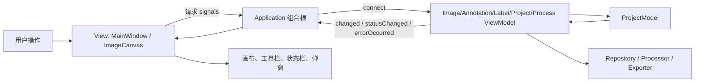
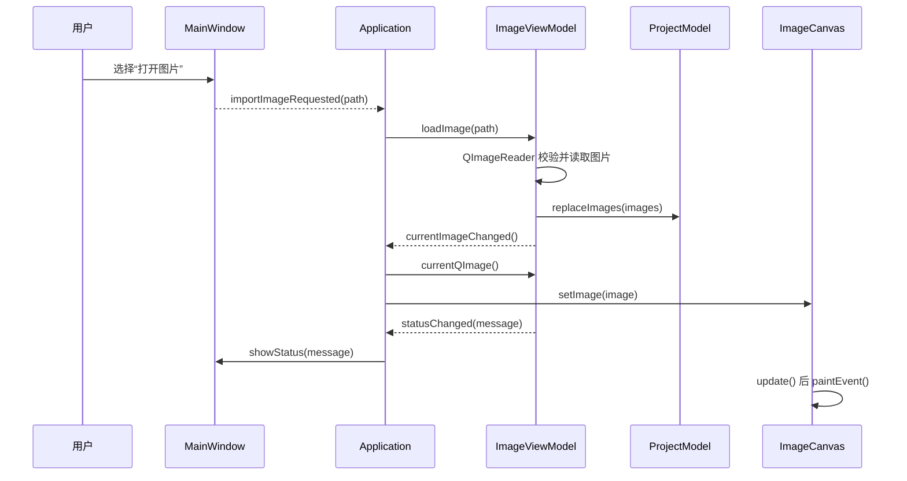
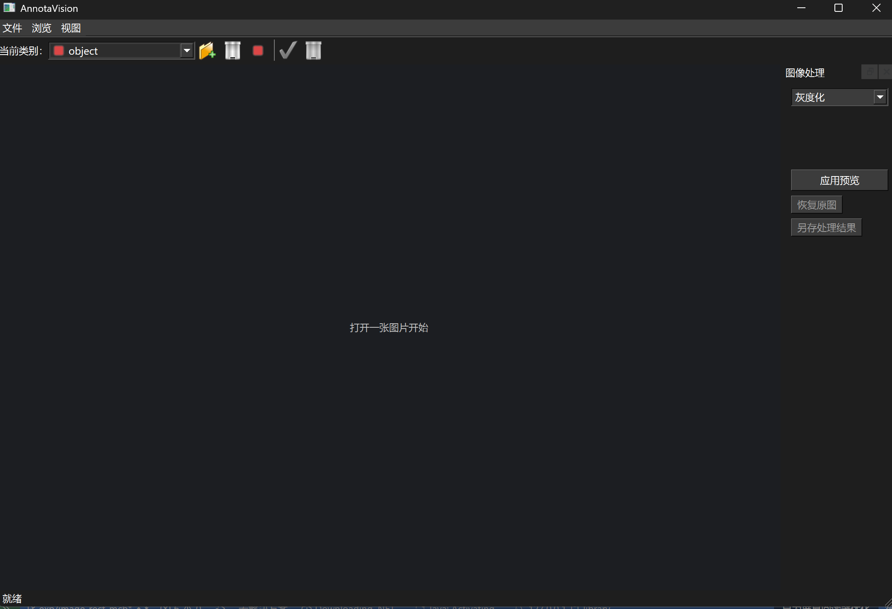
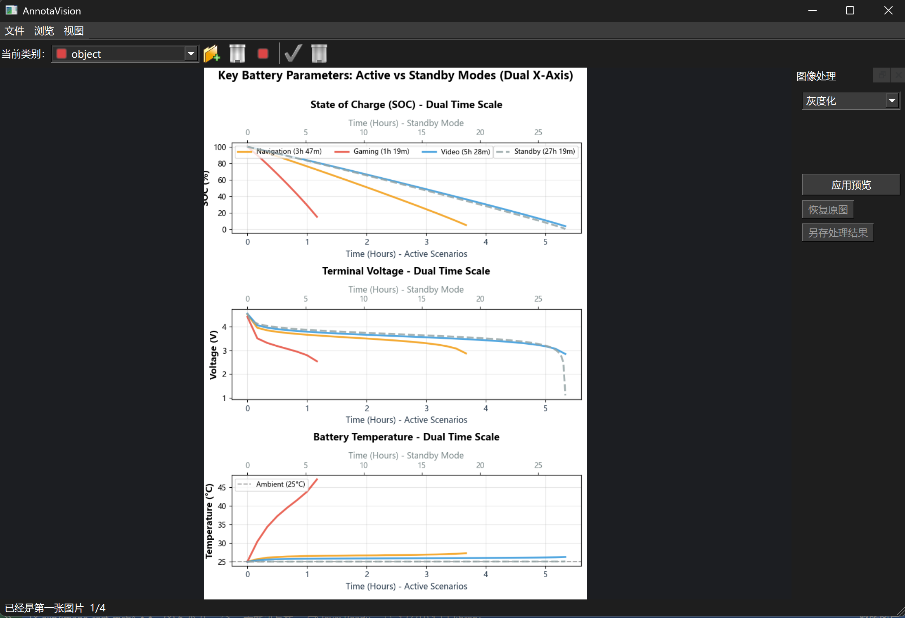
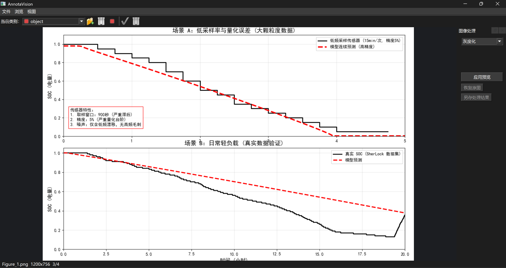
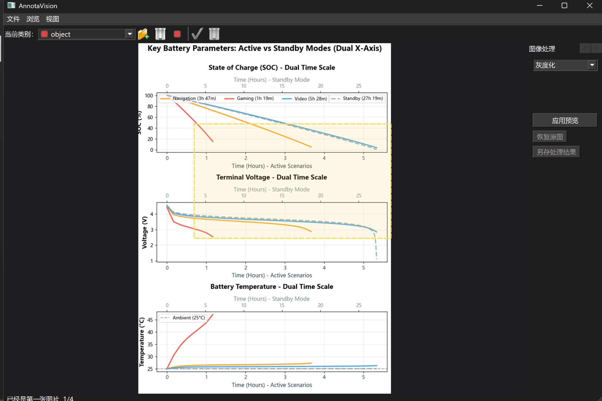
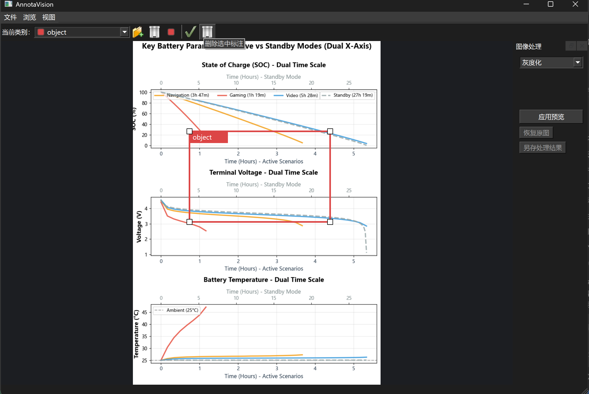
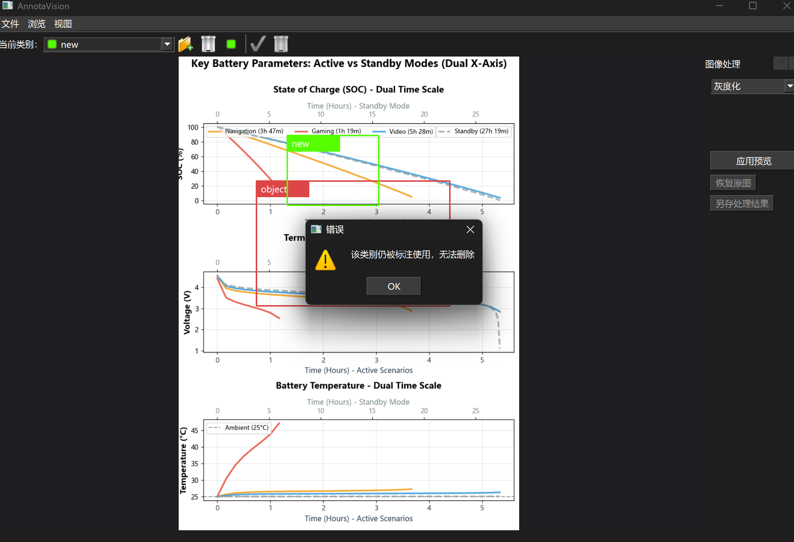
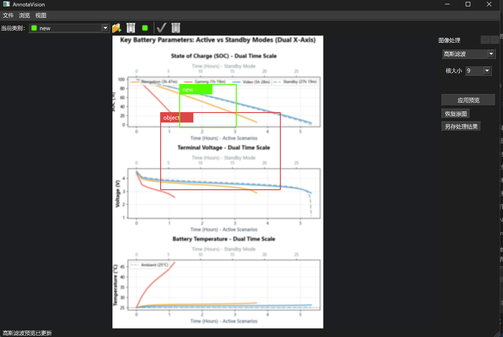

# PixelTagger（AnnotaVision）项目成果与学习总结
## 摘要

PixelTagger是面向图像浏览、矩形框标注和基础图像处理场景的 Windows 桌面程序。项目以 C++17、Qt Widgets 和 CMake 为基础，通过 Model、ViewModel、View 以及负责对象装配和信号绑定的 `Application` 组合根划分职责。当前源码涉及图片导入、文件夹浏览、缩放平移、矩形标注、多类别管理、标注选择与编辑、JSON 项目保存/读取、OpenCV 处理预览和 YOLO 数据集导出等代码路径；这些功能仍需结合真实运行截图和人工验收确认。Qt signal/slot 用于传递用户请求、状态变化和错误反馈，Model 作为项目数据的业务状态来源。

## 1. 项目概述

### 1.1 项目背景

图像数据进入训练、检索或质量分析流程前，通常需要完成浏览、筛选、类别定义和空间标注。桌面工具可以直接利用本地文件系统和鼠标交互，减少手工记录坐标的成本，并让标注状态、项目文件和导出结果形成可复核的数据链。PixelTagger 以课程工程实践为载体，在有限规模内探索 Qt GUI、C++ 对象设计、MVVM 分层、持久化和协作开发的组合方式。

### 1.2 项目目标

当前阶段目标是：导入单图或图片文件夹；浏览并显示图片状态；提供缩放、平移及矩形框创建、选择、移动、调整大小和删除；管理多个类别；保存/读取 JSON 项目；预览并另存基础 OpenCV 处理结果；导出 YOLO 数据集；通过 CMake 统一构建并为核心逻辑配置 Qt Test。

完整项目的远期目标是形成更成熟的标注工作台，包括多边形或画笔工具、撤销/重做、自动保存、更多导入导出格式、大数据量异步加载、部署与持续集成。

### 1.3 项目功能与代码位置

| 功能模块        | 相关位置                                                           | 代码说明                                                               |
| --------------- | ------------------------------------------------------------------ | ---------------------------------------------------------------------- |
| 工程配置        | `CMakeLists.txt`、`CMakePresets.json`                              | 声明 C++17、`AnnotaVision`、Qt Widgets、OpenCV、CTest 与 VS 预设       |
| 打开单张图片    | `MainWindow.cpp`、`ImageViewModel.cpp`                             | 文件对话框发出请求，支持 PNG/JPG/JPEG/BMP/GIF                          |
| 打开图片文件夹  | `ImageViewModel::importFolder`                                     | 非递归、按名称扫描可读图片；遇到不可读文件则整次导入失败               |
| 上一张/下一张   | `MainWindow::createMenus`、`ImageViewModel`、`ProjectModel`        | 菜单及 PgUp/PgDown、Ctrl+Left/Ctrl+Right；首尾给出状态提示             |
| 状态栏反馈      | `ImageViewModel::loadCurrentImage`、`MainWindow::showStatus`       | 显示文件名、分辨率和当前位置/总数                                      |
| 异常提示        | 各 ViewModel、`Application::bindFeedback`、`MainWindow::showError` | 业务错误经 `errorOccurred` 显示警告框                                  |
| 矩形图像标注    | `ImageCanvas`、`AnnotationViewModel`、`ProjectModel`               | 原图坐标保存；支持创建、选择、移动、四角调整和删除；无多边形/画笔      |
| 类别管理        | `LabelViewModel`、`MainWindow`                                     | 新增、删除、重命名、改色、切换和修改标注类别                           |
| 项目保存/读取   | `JsonProjectRepository`、`ProjectViewModel`                        | 使用 Qt JSON API；图片路径按项目文件位置解析，不使用 nlohmann-json     |
| YOLO 导出       | `YoloExporter`、`ProjectViewModel::exportYolo`                     | 输出图片、标签、`classes.txt`、`data.yaml`；CTest 中该测试目标本轮异常 |
| OpenCV 图像处理 | `ImageProcessor`、`ProcessViewModel`、处理停靠面板                 | 灰度、二值、三类滤波、Canny、亮度、对比度预览和另存                    |

## 2 使用流程

1. 构建并启动 `AnnotaVision.exe`，检查空画布和“就绪”状态。
2. 使用“文件 → 打开图片”选择 PNG、JPG、JPEG、BMP 或 GIF。
3. 或使用“打开图片文件夹”加载目录中按名称排序的图片。
4. 使用“浏览”菜单、PgUp/PgDown 或 Ctrl+Left/Ctrl+Right 切换图片。
5. 从状态栏查看文件名、分辨率和“当前位置/总数”。
6. 在画布空白处左键拖拽创建矩形框；选择框后可移动、调整、改类别或删除。
7. 可保存 JSON 项目、预览图像处理结果或选择空目录导出 YOLO 数据集。
8. 遇到空目录、无效图片或业务错误时查看弹窗；首尾导航提示显示在状态栏。

## 3. 系统总体设计

### 3.1 技术栈

| 技术                | 项目中的用途                                 | 选择原因                             | 仓库或环境依据                                |
| ------------------- | -------------------------------------------- | ------------------------------------ | --------------------------------------------- |
| C++17               | 业务模型、算法封装和应用组合                 | 类型系统、RAII，与 Qt/CMake 配合成熟 | `CMakeLists.txt` 声明 `CMAKE_CXX_STANDARD 17` |
| Qt Widgets          | 窗口、菜单、对话框、绘制、JSON、测试、信号槽 | 适合传统桌面 GUI                     | CMake 查找 Qt 6 Widgets；                     |
| CMake 3.20+         | 目标、依赖、测试和 VS 工程生成               | 跨 IDE、可复现配置                   | 项目最低版本 3.20；本轮命令版本为 4.2.0       |
| Visual Studio/MSVC  | Windows 编译和调试                           | 与 Qt Windows kit、CMake 生成器配合  | CMake 缓存生成器为 Visual Studio 2022         |
| vcpkg               | 为 CMake 提供 Qt/OpenCV 工具链和运行时部署   | 统一第三方依赖发现                   | VS 预设和本地缓存包含 vcpkg toolchain         |
| OpenCV core/imgproc | 基础图像处理                                 | 提供成熟矩阵与滤波算法               | CMake 声明并链接 core、imgproc                |
| Qt JSON API         | 项目序列化                                   | 无需增加额外 JSON 依赖               | Repository 使用 Qt JSON；未发现 nlohmann-json |


### 3.2 系统架构

当前实现是“MVVM + Application 组合根 + Repository/Processor/Exporter”。



Qt signal 采用强类型参数传递，可在编译阶段发现类型不匹配，避免 `std::any` 可能引发的运行时参数错误和 `std::bad_any_cast`；在此基础上，系统还可进一步扩展通用的撤销/重做命令历史机制。


### 3.3 项目目录结构

```text
PixelTagger/
|-- CMakeLists.txt
|-- CMakePresets.json
|-- README.md
|-- docs/
|   |-- mvvm.md
|   |-- *-team-handoff.md
|   `-- report/
|-- src/
|   |-- app/          # Application 对象装配与信号绑定
|   |-- common/       # ID、Result、变化枚举和展示 DTO
|   |-- model/        # 项目、图片、类别、标注实体
|   |-- viewmodel/    # 图片、标注、类别、项目和处理业务
|   |-- view/         # MainWindow、ImageCanvas、坐标映射
|   |-- repository/   # JSON 项目持久化
|   |-- processor/    # Qt/OpenCV 转换与图像算法
|   |-- exporter/     # YOLO 数据集导出
|   `-- main.cpp
`-- tests/           # Qt Test 自动化测试
```

`src/main.cpp` 只创建 `QApplication` 和 `Application`；`Application` 保证共享 `ProjectModel` 只有一个实例。`common/presentation` 的 DTO 防止 View 直接依赖可写 Model。
### 3.4 核心数据流

打开单图时，`MainWindow` 选择路径并发出 `importImageRequested`；`Application` 将其连接到 `ImageViewModel::loadImage`；ViewModel 用 `QImageReader` 读取元数据，调用 `ProjectModel::replaceImages`，再解码当前图并发出变化和状态信号。

加载文件夹时，`ImageViewModel::importFolder` 使用扩展名过滤并按名称扫描，构建完整 `QVector<ImageModel>` 后一次性替换 Model。上一张/下一张由 `ProjectModel` 改变索引，边界失败时只发布状态文本。所有 ViewModel 错误最终由 `Application::bindFeedback` 连接至 `MainWindow::showError`。



## 4. 核心模块设计与代码结构

### 4.1 主窗口模块

`MainWindow` 创建“文件、浏览、视图”菜单、标注工具栏和图像处理停靠面板。文件对话框负责收集图片、文件夹、JSON 项目、导出目录及处理结果路径；窗口不直接修改 `ProjectModel`。图片打开使用 `QKeySequence::Open`，保存项目使用 `QKeySequence::Save`，浏览使用 PgUp/PgDown 与 Ctrl+方向键，删除标注使用 Delete，缩放和适应窗口也有快捷键。状态反馈进入 `QStatusBar`，错误通过 `QMessageBox::warning` 展示。

其局限是菜单和处理面板均在一个实现文件中，规模继续扩大后可拆成专用 widget/action factory；此外 GUI 请求由 signals 暴露，依赖 `Application` 完整绑定，缺少绑定会静默失效。

### 4.2 图像显示模块

`ImageCanvas::paintEvent` 先绘制深色背景；无图时居中显示“打开一张图片开始”。有图时根据 `Qt::KeepAspectRatio` 计算视口，结合缩放因子和偏移居中绘制，设置 `QPainter::SmoothPixmapTransform` 实现平滑显示。`setImage` 清理交互状态、重置缩放和平移、更新坐标映射并调用 `update()`；`setAnnotations` 同样触发重绘。

`CoordinateMapper` 在窗口坐标与原图坐标间转换，因此标注不会因窗口缩放改变业务坐标。Canvas 还支持滚轮缩放、中键平移、命中选择、矩形创建、移动和四角缩放。当前只提供矩形，且大图作为完整 `QImage` 保存在内存中，没有瓦片化或分级缓存。

### 4.3 图片业务模块

`ImageViewModel` 集中处理单图导入、文件夹扫描、当前图解码和导航。支持后缀为 PNG、JPG、JPEG、BMP、GIF；GIF 通过普通 `QImage` 加载路径处理，代码中没有动画帧播放逻辑，因此只应视为静态显示。`readImage` 保存绝对路径、文件名、相对路径和宽高，导入时初始化 `modified=false`。状态文本格式为“文件名 宽x高 当前位置/总数”。

首尾导航不改变索引，并发布“已经是第一/最后一张图片”。空文件夹、目录不存在、图片不可读或当前图解码失败则发出 `errorOccurred`。目录扫描非递归且同步；为了便于实现，我们目前选择的异常处理方案是任一候选图片不可读会终止整批导入。

### 4.4 数据模型模块

`ImageModel` 保存 `id`、文件绝对/相对路径、文件名、宽高、修改状态和标注列表。`AnnotationModel` 保存标注 ID、类别 ID 和原图坐标 `QRectF`；`LabelModel` 保存类别 ID、名称和颜色。

`ProjectModel` 保存图片列表、类别列表、当前索引、项目修改状态及下一组实体 ID。它提供受控的替换项目、导航、增加/删除/更新标注、类别增删改查、占用检查和 `markSaved`，避免 View 获得可写数据指针。

当前调用边界是：View 发出强类型请求 signal，`Application` 将请求连接到对应 ViewModel；ViewModel 修改 Model，再以 `changed`、`statusChanged`、`errorOccurred` 等信号反向通知。这降低了 View 与具体业务实现的耦合，并保留统一接入快捷键的入口。


### 4.6 标注、类别、处理与导出模块

`AnnotationViewModel` 将拖拽框归一化并裁剪到图片边界，拒绝小于 3×3 原图像素的框；它维护当前类别与选中标注 ID，并通过 `AnnotationRenderItem` 向 Canvas 提供颜色、名称和选中状态。`LabelViewModel` 处理类别新增、删除、重命名、改色和当前类别切换；正在使用的类别由 Model 保护。

`ProcessViewModel` 使用 `ImageConverter` 在 `QImage` 与 `cv::Mat` 之间转换，调用 `ImageProcessor` 生成非破坏性预览，支持恢复原图与另存结果。预览不直接回写项目图片或标注坐标。`JsonProjectRepository` 负责项目文件，`YoloExporter` 验证图片、类别与矩形后在暂存目录生成数据集，并拒绝非空导出目录和重名输出。YOLO 当前将同一 `images` 同时写作 train/val 路径，尚未实现数据集划分策略。

## 5. 项目界面与验证材料

本章采用一张主界面图和三组并排图片。并排布局既保留了操作前后的对照关系，也避免每张截图单独占满一页。图片说明紧跟截图，便于将界面现象与前文代码分析对应起来。

### 5.1 程序启动与界面布局

{ width=60% }

图 5-1 程序启动后的主界面

启动后可以看到“文件、浏览、视图”菜单、类别工具栏、中央画布、图像处理面板和状态栏。未载入图片时，`ImageCanvas` 显示“打开一张图片开始”，状态栏显示“就绪”，与 `MainWindow` 创建控件以及 `ImageCanvas::paintEvent` 处理空状态的代码一致。

### 5.2 文件夹加载、导航与边界反馈

|                         文件夹第一张与首张边界反馈                         |                        切换后的图片与位置反馈                        |
| :------------------------------------------------------------------------: | :------------------------------------------------------------------: |
| { width=47% } | { width=47% } |
|                 图 5-2 文件夹第一张图片，状态栏显示 `1/4`                  |                    图 5-3 切换后状态栏显示 `3/4`                     |

两张图共同记录了 `ImageViewModel` 的文件夹浏览链路：加载目录后显示第一张图片，执行导航后更新画面、文件名、分辨率和当前位置。图 5-2 还显示“已经是第一张图片”的边界反馈，说明越界导航不会继续减小当前索引。单张图片导入没有另设 02 号截图，其显示结果已由本章其他真实图片覆盖。

> `assets/04emptyfile.png` 已记录空文件夹错误弹窗，但原图包含本机绝对路径，当前不在正文中引用。提交前如需采用，应先遮挡个人目录，再在此处补入脱敏后的截图。

### 5.3 矩形标注创建、调整与删除

|                          创建矩形标注                           |                                  调整和删除已选标注                                  |
| :-------------------------------------------------------------: | :----------------------------------------------------------------------------------: |
| { width=47% } | { width=47% } |
|                   图 5-4 创建矩形标注时的边界                   |                         图 5-5 选中标注后的控制点与删除入口                          |

图 5-4 展示 Canvas 将鼠标拖动转换为原图坐标矩形的过程；图 5-5 中的红色边框和四角控制点表明标注已进入选中状态，可以继续移动或调整尺寸，工具栏同时提供删除入口。这组图片对应 `ImageCanvas` 的命中、拖拽与坐标映射，以及 `AnnotationViewModel` 对矩形边界和最小尺寸的约束。

### 5.4 类别约束与 OpenCV 处理预览

|                           类别使用约束                           |                       高斯滤波预览                       |
| :--------------------------------------------------------------: | :------------------------------------------------------: |
| { width=47% } | { width=47% } |
|             图 5-6 删除正在使用的类别时给出错误提示              |              图 5-7 高斯滤波参数与处理预览               |

图 5-6 记录了类别被标注占用时的保护逻辑，界面没有直接破坏已有标注与类别之间的对应关系。图 5-7 展示 `ProcessViewModel` 调用 OpenCV 生成高斯滤波预览；右侧参数和状态栏反馈与画布结果位于同一画面中，便于核对操作及结果。该预览是非破坏性的，不等同于覆盖项目原图。

### 5.5 JSON 项目数据

T08 的保存结果以 JSON 文件而非界面截图保存。为控制篇幅，正文仅摘录格式标识、类别和一条标注；[脱敏后的完整项目 JSON](assets/textPicture.json) 保留了 4 张图片、2 个类别及当前图片中的 2 条矩形标注。

```json
{
  "format": "PixelTaggerProject",
  "version": 1,
  "labels": [
    { "id": 0, "name": "object", "color": "#dc4646" },
    { "id": 1, "name": "new", "color": "#55ff00" }
  ],
  "images": [
    {
      "file_name": "1.png",
      "width": 719,
      "height": 1000,
      "annotations": [
        {
          "id": 1,
          "label_id": 0,
          "rect": {
            "x": 164.15,
            "y": 262.79,
            "width": 408.53,
            "height": 263.57
          }
        }
      ]
    }
  ]
}
```

代码清单 5-1 项目 JSON 的脱敏节选

该文件验证 `JsonProjectRepository` 写出的层次包括项目格式、图片元数据、类别和矩形标注。示例中的绝对路径已统一替换为 `***REDACTED***`；JSON 只证明项目数据持久化结果，YOLO 目录结构及边界行为仍由对应自动化测试记录支撑。


## 6. 构建、运行与测试

### 6.1 开发环境与构建命令

#### Windows / MSVC 主开发环境

| 项目          | Windows 本机配置                                                 |
| ------------- | ---------------------------------------------------------------- |
| 操作系统      | Microsoft Windows 11 家庭版 中文版 25H2，64 位，Build 26200.8875 |
| 编译器        | MSVC 19.41.34123.0，x64 工具链                                   |
| Visual Studio | Visual Studio Community 2022 17.11.5（安装版本 17.11.35327.3）   |
| CMake         | 4.2.0；项目在 `CMakeLists.txt` 中要求不低于 3.20                 |
| Qt            | Qt 6.11.1，vcpkg `x64-windows` 包；项目使用 Qt Widgets           |
| C++ 标准      | C++17                                                            |
| OpenCV        | OpenCV 4.12.0，vcpkg `x64-windows` 包；项目链接 core、imgproc    |
| vcpkg         | 2026-05-27，目标 triplet 为 `x64-windows`                        |

Windows 环境使用仓库中的 Visual Studio 2022 预设。`VCPKG_ROOT` 需指向已安装依赖的 vcpkg 根目录；若 Qt 不在 vcpkg 或 CMake 默认搜索路径中，再通过 `CMAKE_PREFIX_PATH` 指定 Qt kit。

```powershell
cmake --preset vs2022-x64
cmake --build --preset vs2022-x64 --config Debug
ctest --test-dir build/vs2022-x64 -C Debug --output-on-failure
```

#### WSL2 / GCC 开发环境（团队成员提供）

| 项目       | WSL2 环境配置                                                                                            |
| ---------- | -------------------------------------------------------------------------------------------------------- |
| 操作系统   | Ubuntu 24.04.3 LTS（WSL2），内核 6.18.33.2-microsoft-standard-WSL2，x86_64                               |
| 编译器     | GCC/G++ 13.3.0，`/usr/bin/c++`                                                                           |
| 构建生成器 | Unix Makefiles                                                                                           |
| CMake      | 3.28.3；项目在 `CMakeLists.txt` 中要求不低于 3.20                                                        |
| Qt         | Qt 6.4.2，来自 WSL/Ubuntu 系统路径 `/usr/lib/x86_64-linux-gnu/cmake/Qt6`；项目使用 Qt Widgets            |
| C++ 标准   | C++17                                                                                                    |
| OpenCV     | OpenCV 4.6.0，来自 WSL/Ubuntu 系统路径 `/usr/lib/x86_64-linux-gnu/cmake/opencv4`；项目链接 core、imgproc |
| vcpkg      | WSL 构建未使用 vcpkg；依赖来自 Ubuntu 系统包                                                             |

WSL2 环境不使用当前预设中的 vcpkg 工具链，而是通过 Unix Makefiles 和系统安装的 Qt/OpenCV 配置包单独建立构建目录：

```bash
cmake -S . -B build/wsl \
  -G "Unix Makefiles" \
  -DCMAKE_BUILD_TYPE=Debug \
  -DQt6_DIR=/usr/lib/x86_64-linux-gnu/cmake/Qt6 \
  -DOpenCV_DIR=/usr/lib/x86_64-linux-gnu/cmake/opencv4

cmake --build build/wsl --parallel
ctest --test-dir build/wsl --output-on-failure
```

上述版本组合与 Ubuntu 24.04 系统工具链相符，可作为团队的 Linux 开发环境记录。该表及命令由对应团队成员提供；环境配置和命令本身不等同于构建通过，跨平台构建结果应另以该环境中的配置、编译和测试输出为准。
<!-- 
### 6.2 测试方案结果

以下 GUI 结果依据团队成员对当前程序的人工验收填写。已归档的图片和 JSON 直接列在证据栏；未单独留图或仍需脱敏的场景会明确说明，不能以“通过”代替缺失的证据材料。

| 编号 | 功能场景                   | 测试内容（含边界）                                                                               | 预期结果                                                                                      | 实际结果                                                      | 证据                                                                                         |
| ---- | -------------------------- | ------------------------------------------------------------------------------------------------ | --------------------------------------------------------------------------------------------- | ------------------------------------------------------------- | -------------------------------------------------------------------------------------------- |
| T01  | 程序启动与界面             | 启动程序，检查菜单、工具栏、处理面板、空画布和状态栏                                             | 窗口正常显示；未加载图片时画布显示引导文字，状态栏显示“就绪”                                  | 通过：界面组件显示正常，程序保持可操作                        | 成员人工验收；图 5-1                                                                         |
| T02  | 单张图片导入与显示         | 打开 PNG/JPG 图片并改变窗口大小；同时尝试选择损坏的图片文件                                      | 有效图片按比例显示并给出文件名、分辨率和 `1/1`；损坏图片给出错误提示                          | 通过：有效图片正常显示，窗口变化后保持比例；损坏图片被拒绝    | 成员人工验收；本轮未单独留图                                                                 |
| T03  | 文件夹加载与图片导航       | 打开含多张图片的文件夹，执行上一张/下一张；在第一张和最后一张继续执行越界导航                    | 图片按名称载入，状态栏显示当前位置/总数；越界时索引不变并给出提示                             | 通过：图片切换和位置显示正常，首尾边界处理符合预期            | 成员人工验收；图 5-2、图 5-3                                                                 |
| T04  | 文件夹异常处理             | 分别选择空文件夹和不存在可读图片的文件夹                                                         | 不替换当前有效图片列表，并弹出“文件夹中没有可打开的图片”等错误提示                            | 通过：异常目录被拒绝，界面显示错误信息                        | 成员人工验收；原截图待路径脱敏                                                               |
| T05  | 矩形标注创建               | 在图片内部拖出正常矩形，再尝试拖出小于 3×3 像素或越过图片边界的矩形                              | 正常矩形写入当前图片；过小矩形被忽略；越界矩形被限制在图片范围内                              | 通过：标注创建、最小尺寸和图片边界限制正常                    | 图 5-4；`AnnotationEditingTests`                                                             |
| T06  | 标注选择与编辑             | 选择标注后移动、拖动四角、修改类别并按 Delete 删除；未选择标注时检查删除入口                     | 编辑结果使用原图坐标保存；删除后标注消失；无选择时删除入口不可用或给出提示                    | 通过：移动、缩放、改类别和删除行为正常                        | 图 5-5；`AnnotationEditingTests`、`MainWindowAnnotationTests`、`ImageCanvasInteractionTests` |
| T07  | 类别管理                   | 新增类别、切换类别、重命名和修改颜色；尝试空名称、重复名称、删除最后一个类别或删除正在使用的类别 | 合法修改同步到工具栏和标注；非法操作被拒绝并保留原状态                                        | 通过：类别增删改查及约束检查正常                              | 图 5-6；`ProjectModelLabelTests`、`MultiLabelViewModelTests`                                 |
| T08  | 项目保存、读取与 YOLO 导出 | 保存 JSON 项目后重新打开，检查图片、类别和标注；向空目录导出 YOLO，再尝试导出到非空目录          | 项目数据能够恢复；空目录生成 `images`、`labels`、`classes.txt` 和 `data.yaml`；非空目录被拒绝 | 通过：项目保存/读取和 YOLO 导出结果符合预期，异常目录未被覆盖 | [项目 JSON](assets/textPicture.json)；`YoloExporterTests`、`ProjectExportViewModelTests`     |
| T09  | OpenCV 图像处理            | 检查灰度、二值、滤波、Canny、亮度和对比度预览，并执行恢复原图和另存；无源图或非法参数时再次执行  | 各处理产生预览且不修改项目原图；恢复和另存有效；非法输入给出错误且不覆盖已有预览              | 通过：处理预览、恢复、另存和参数校验正常                      | 图 5-7；`ImageProcessorTests`、`ProcessViewModelTests`                                       |

自动化测试方面，`CMakeLists.txt` 登记 9 个 Qt Test 目标，覆盖类别 Model/ViewModel、标注编辑、主窗口删除动作、Canvas 缩放与编辑、OpenCV 处理、处理 ViewModel、YOLO 导出和项目导出。2026-07-18 在本机重新执行 Debug 构建及

```powershell
ctest --test-dir build/vs2022-x64 -C Debug --output-on-failure
```

测试结果为 9/9 通过、0 项失败，通过率 100%，总耗时 9.43 秒。该结果说明当前自动化测试目标在本机环境下均能运行，但测试范围不能代替上述 GUI 人工验收和截图证据。 -->

<!-- 觉得五已经写过了就没有写 -->
## 7. 团队协作与项目管理

### 7.1 团队分工
| 成员      | 主要角色       | 负责模块                                                                                                                                                         | 主要产出                                | 协作对象   |
| --------- | -------------- | ---------------------------------------------------------------------------------------------------------------------------------------------------------------- | --------------------------------------- | ---------- |
| 张程龄 | Model/ViewModel层负责 | ProjectModel、Annotation/Label/Process/Project ViewModel、Processor、Exporter、自动测试 | 多类别与标注编辑业务、OpenCV 图像处理、YOLO 导出、分类测试及交接文档 | App 层和 View 层成员 |
| 朱珂晗 | Application 集成与测试文档负责 | `Application` 装配层、`CMakeLists.txt` 构建配置、View 交互接入与测试 | App 层对象装配和信号槽绑定完善；删除标注入口和画布交互功能恢复；界面交互测试补充；UTF-8 构建配置与报告截图、材料整理 | Model/ViewModel 层和 View 层成员 |
| 倪泠 | View 层界面接入与运行验证负责 |  View 层的 `MainWindow` 和`ImageCanvas`  | 主窗口菜单、工具栏、按钮和快捷键等用户操作入口；验证界面入口能正确触发 ViewModel / Application 绑定后的业务流程 | ViewModel / Model、Application 成员 |

同时，使用了类别编辑、图像处理和 YOLO 的交接文档，便于团队成员协作。

### 7.3 模块集成方式

团队可围绕稳定接口并行：Model 约定实体 ID、原图矩形与 dirty 语义；ViewModel 暴露业务方法和强类型信号；`Application` 统一连接；View 只处理绘制和输入；CMake 负责把新增源文件、库和测试接入目标。成员在各自负责层完成开发后，通过 `Application` 绑定、构建配置和界面验收把功能串联为完整流程。

## 8. 智能体使用说明

### 8.1 智能体基本配置


| 配置项     | 实际配置                                            |
| ---------- | --------------------------------------------------- |
| 智能体名称 | Codex                                               |
| 使用方式   | 当前为仓库工作区会话；CLI、IDE |
| 使用模型   | GPT 5.6sol                                          |
| 工作目录   | PixelTagger 仓库根目录                              |


### 8.2 规则文档

仓库已在 `.agents/skills/` 中加入可随代码共同提交的团队 Skill。该 Skill 将项目的 MVVM 约束转化为智能体执行架构评审、功能开发、重构和验收时需要遵循的工作流程，使规则不再只依赖某位成员本地保存的说明文件。

| 文档或规则文件                                                                                                                      | 本项目采用的约束与用途                                                                                                                                                                                                                                            |
| ----------------------------------------------------------------------------------------------------------------------------------- | --------------------------------------------------------------------------------------------------------------------------------------------------------------------------------------------------------------------------------------------------------------- |
| [`.agents/skills/enforce-pixeltagger-mvvm/SKILL.md`](../../.agents/skills/enforce-pixeltagger-mvvm/SKILL.md)                         | 定义团队 Skill 的触发范围和执行步骤。处理 PixelTagger 架构、分层、信号绑定或功能模块时，智能体需要先核对当前指导与代码，再判断职责归属、依赖方向和状态所有权，并在修改后检查跨层依赖、测试及构建结果。                                                          |
| [`.agents/skills/enforce-pixeltagger-mvvm/references/mvvm-architecture-guideline.md`](../../.agents/skills/enforce-pixeltagger-mvvm/references/mvvm-architecture-guideline.md) | 保存团队共享的完整 MVVM 架构指导，规定 `ProjectModel` 是业务数据的唯一真实来源，`Application` 只负责对象装配和绑定，View 不访问 Model，ViewModel 通过受控接口修改 Model，并将 Repository、Processor、Exporter 的职责与业务层分离。                    |
| [`docs/mvvm.md`](../mvvm.md)                                                                                                        | 结合当前实现说明信号流和展示数据流。较大的标注、类别和图像数据由专用无参 signal 通知变化，再由 `Application` 调用 ViewModel getter 拉取；布尔值、实体 ID 和状态消息等小型数据可直接作为 signal 参数传递。                                                     |
| [`docs/annotation-category-edit-team-handoff.md`](../annotation-category-edit-team-handoff.md)                                      | 约束已有标注改类别的跨层接口，规定 Canvas 在 View 层完成命中测试和坐标转换，Model/ViewModel 只接收原图坐标和稳定实体 ID，并给出 App、View 接入及自动测试要求。                                                                                                  |
| [`docs/image-processing-team-handoff..md`](../image-processing-team-handoff..md)                                                    | 规定处理结果采用非破坏性预览，OpenCV 算法位于 Processor，处理参数和预览状态由 `ProcessViewModel` 管理，View 只表达用户操作，`Application` 不执行算法。                                                                                                        |
| [`docs/yolo-export-team-handoff.md`](../yolo-export-team-handoff.md)                                                                | 规定 View 只提供导出目录，YOLO 坐标转换、类别编号和文件生成由 Exporter 负责，`ProjectViewModel` 组织请求与结果通知，`Application` 不修改导出数据。                                                                                                          |

团队使用智能体处理代码时，以团队 Skill 和其中的完整架构指导作为通用边界，再根据具体功能读取相应 handoff；`docs/experiment-report-mid.md` 只用于了解 Command 方案调整、导入职责归属等历史决策，不作为当前强制规则。若代码需求与既有规则发生冲突，应由成员先确认架构是否需要调整，并同步更新团队 Skill 和指导文档，不能仅为减少局部修改而绕过分层。

### 8.3 团队成员与智能体的分工机制

本项目按“谁承担判断责任”划分人机工作，而不是简单按代码量分工。团队成员负责决定做哪些功能以及采用什么接口，智能体负责在既定范围内加快检索、整理和重复检查；涉及架构取舍、界面体验和最终交付的结论仍由成员确认。


| 工作环节   | 团队成员职责                                                                                                                | 智能体的作用                                                                                                                                                                            |
| ---------- | --------------------------------------------------------------------------------------------------------------------------- | --------------------------------------------------------------------------------------------------------------------------------------------------------------------------------------- |
| 需求与架构 | 确认矩形标注、类别管理、项目保存、YOLO 导出和图像处理的功能范围；决定 MVVM 边界及数据兼容策略                               | 快速检索相关类、信号槽和调用链，对照 `docs/mvvm.md` 及交接文档梳理现状；识别接口缺失、依赖方向错误和职责越界；给出可供团队评审的实现方案，但不代替成员作最终架构决策                    |
| 实现与集成 | 约定 Model、ViewModel 和 View 的公共接口；审核 `Application.cpp`、`CMakeLists.txt` 等共享文件的修改；处理冲突并决定是否合并 | 在明确范围内完成初步代码修改；追踪“View 请求—Application 绑定—ViewModel—Model—通知刷新”的完整链路；补充信号槽连接、对象装配和构建配置；列出受影响文件及潜在冲突点，辅助成员进行代码审查 |
| 构建与测试 | 提供实际开发环境，运行并观察 GUI；判断缩放、平移、标注拖动、大小调整和错误提示等交互是否符合预期                            | 执行 CMake 配置、编译、CTest 和针对性测试；补充可重复执行的单元测试与交互测试；记录测试结果、失败日志、复现命令和环境依赖；协助定位编译、链接、Qt 插件及运行时问题                      |
| 缺陷定位   | 结合实际操作确认问题现象、影响范围和修复优先级                                                                              | 检索相关代码和历史修改，分析信号是否发出、槽函数是否连接、状态是否正确刷新；缩小故障范围并提出候选修复方案，减少人工排查成本                                                            |
| 文档与交接 | 审核文档内容是否符合实际实现，确认最终功能描述和团队分工                                                                    | 根据代码、测试和提交记录整理功能清单、调用链、测试命令及交接说明；                                                                                                                      |

## 9. 项目实际效果与问题分析


### 9.1 技术优点

目录职责清晰，Model 不依赖界面，ViewModel 集中业务状态，`Application` 统一请求绑定，Qt signal 用于反向通知。图片绘制、坐标映射与项目业务分离，标注坚持原图坐标；展示 DTO 避免 View 获得可写 Model；Repository、Processor 和 Exporter 形成清晰的外围能力边界。

### 9.2 当前不足

- 标注类型只有矩形，没有多边形、画笔或关键点。
- 缺少撤销/重做、自动保存和最近项目；modified 状态尚未形成完整关闭提醒流程。
- 文件夹一次性同步扫描和逐图读元数据，大目录可能阻塞；失败策略会因单个坏文件中止全部导入。
- 大图完整解码并复制到处理 ViewModel，内存占用和响应时间有风险。
<!-- TODO：要不要写存疑
### 9.4 

#### P0：巩固最小标注闭环

P0 应优先核验矩形、类别、保存/读取和修改状态相关代码路径，补充关闭前未保存提示、项目 schema 版本、重新加载回归测试、YOLO CTest 异常定位，并以真实 GUI 测试确认创建—编辑—保存—重开闭环；再评估多边形等新标注实体。

#### P1：工程可用性

引入强类型撤销/重做命令、自动保存、最近项目、操作快捷键说明、异步目录扫描、坏图跳过策略和更细粒度错误信息。缩放和平移存在相关代码，P1 还需补充体验验证与边界优化。

#### P2：格式与处理能力

扩展通用 JSON/XML 标注导出、YOLO 数据集划分、批处理和更多 OpenCV 流程；只有在确有跨库需求时再评估 nlohmann-json。以上均列入后续计划。 -->


## 11. 个人总结
<!-- TODO -->


### 11.1 成员一：张程龄

#### 承担角色

&emsp;&emsp;我在项目中主要承担 Model、ViewModel 和核心功能模块的设计与实现，同时负责相关自动测试、构建验证和接口交接。工作重点不是直接编写窗口控件，而是为界面操作提供稳定的业务能力，包括多类别管理、标注编辑、图像处理预览、项目级操作和 YOLO 数据集导出。在团队协作中，我还参与梳理严格 MVVM 的依赖方向，使 `ProjectModel` 成为图片、类别和标注的唯一真实数据源，并通过明确的 presentation 契约和专用信号与 App、View 层协作。

#### 参与内容

&emsp;&emsp;我参与完善了 `ProjectModel` 及 `AnnotationViewModel` 、`LabelViewModel`等ViewModel模块。多类别功能使用稳定 `LabelId` 关联类别和标注，支持类别新增、删除、重命名、改色以及已有标注改类别；标注编辑部分补充了选择、矩形更新和删除所需的业务接口。图像处理部分通过 `ImageConverter` 完成 `QImage` 与 `cv::Mat` 的转换，由 `ImageProcessor` 实现灰度化、二值化、三种滤波、Canny、亮度和对比度调整，处理结果作为非破坏性预览保存，不回写项目原图。YOLO 导出部分负责连续类别编号、矩形归一化、空标注文件、类别文件和 `data.yaml` 的生成，并对源图缺失、非法标注、重名输出及非空目标目录进行校验。

&emsp;&emsp;为了验证这些功能，我按 Model、ViewModel、Processor 和 Exporter 分类补充 Qt Test，用测试覆盖多类别身份、标注修改失败回滚、图像处理参数、YOLO 坐标结果以及项目通知等路径。功能交给 App、View 层接入前，我分别整理了开放接口、禁止事项、联调步骤和验收条件，减少并行开发时对内部实现的猜测。集成完成后，我会重新配置 CMake、构建 Debug 程序、运行完整测试，并检查 View 是否出现对 Model、ViewModel 或底层功能模块的越层依赖。

#### 主要挑战

&emsp;&emsp;主要挑战来自架构边界和数据一致性，而不是单个 API 的调用。Qt 信号槽很容易让 `MainWindow` 逐渐承担业务转发和状态判断，如果只建立名为 Model、ViewModel、View 的目录，仍可能形成表面分层。多类别加入后，类别名称、下拉框索引、项目内部 `LabelId` 和 YOLO `class_id` 又具有不同语义，混用其中任何一种都会造成重命名、重排或导出后的引用错误。OpenCV 处理还涉及颜色通道、图像所有权和预览生命周期；YOLO 导出则需要保证任何一张图片或一个标注异常时，不留下看似可用但实际不完整的数据集。

&emsp;&emsp;团队并行开发也带来了接口变化和合并风险。Model/ViewModel 完成时，View 和 Application 尚未接入，单独测试通过不能证明完整闭环一定正确。Windows 下 Qt、MSVC、vcpkg 和 OpenCV 的组合还会出现 AutoMoc、运行库、平台插件以及可执行文件被占用等问题，构建成功与程序可交付并不是同一件事。

#### 应对策略

&emsp;&emsp;我将数据身份、展示状态和外部格式分开处理：Model 只保存稳定实体 ID 和原图坐标，ViewModel 根据 Model 生成 `AnnotationRenderItem`、`LabelPresentationData`，YOLO Exporter 再按照类别列表顺序建立独立的连续编号。项目修改统一经过 `ProjectModel` 的受控接口，失败时返回 `Result`，避免 View 或 App 直接写入数据。图像处理始终保留 source image，每项操作从原图重新计算；YOLO 导出先完成全量预检，再写入同一父目录下的暂存目录，全部成功后才移动到最终位置。

&emsp;&emsp;在协作和验证方面，我采用“接口先确定、分层实现、分类测试、接入后复查”的方式。handoff 文档分别限定 App 和 View 的负责范围，保证App 只创建对象和连接信号，View 只选择路径、读取控件和表达用户意图。测试不仅检查成功结果，也覆盖无效类别、越界矩形、缺失源图、目录冲突和错误通知。构建时保留可重复执行的 CMake 命令，并通过 CTest、依赖扫描和程序启动检查区分代码错误、环境错误和运行时部署问题。

#### 能力成长

&emsp;&emsp;这次项目让我对 MVVM 的理解从类名和目录划分深入到依赖方向、对象所有权与状态流动。严格 MVVM 并不是分别建立 Model、ViewModel 和 View 文件夹，而是要求业务数据只有一个可信来源，界面通过用户意图驱动 ViewModel，ViewModel 再使用 Model 的受控接口完成修改，并通过明确的信号和展示数据通知界面刷新。我也逐步理解了 `Application` 组合根的作用：它集中管理对象生命周期和跨层绑定，使 View 不必认识 Model，也避免某个 ViewModel 演变成包揽所有功能的控制中心。

&emsp;&emsp;项目早期经历过职责边界不清和反复调整后，我更直接地体会到，开发开始时搭建合理框架会显著减少后期返工。`ProjectModel`、稳定实体 ID、专用 ViewModel 和跨层展示契约确定后，多类别、标注编辑、图像处理和 YOLO 导出能够沿着既有边界扩展，不需要每增加一项功能就同时改动大量界面、数据和绑定代码。架构也由此成为项目管理的一部分：它为成员分工、接口交接、代码审查和测试范围提供共同依据，减少了并行开发中的猜测和冲突。技术实践方面，我更熟悉了 Qt 信号槽、图像和文件系统类、OpenCV 数据转换及 Qt Test，并形成了检查失败路径、文件副作用和稳定身份的习惯；Git 分支同步、rebase 冲突处理、提交说明和 handoff 文档也逐渐成为与编码同等重要的交付能力。

#### 深度反思

&emsp;&emsp;项目早期，我容易把“完成一个功能”理解为对应方法能够运行，例如图片可以打开、矩形可以创建、算法能够返回结果。随着功能数量增加，这种判断标准很快暴露出局限：一个局部方法正确，并不代表状态属于正确的对象，也不代表失败时数据仍然一致，更不能说明其他团队成员接入后不会绕过原有边界。MVVM 重构让我认识到，架构的价值不在于文件夹看起来整齐，而在于它限制了错误发生的位置。View 不认识 Model 后，界面就无法顺手修改业务数据；Application 只负责装配后，绑定代码就不会逐渐演变成第二个业务层；Model 统一管理 ID、关系和 dirty 状态后，保存、编辑和导出才能基于同一份事实工作。

&emsp;&emsp;我也经历了从追求更多抽象到控制抽象数量的变化。项目曾考虑引入 Service层，但当前规模下，Service层并没有产生足够的复用价值，反而会拉长调用链并模糊责任。后来保留 Repository、Processor 和 Exporter，是因为它们分别承担持久化、算法和外部格式输出，边界可以由具体输入输出说明。这个过程让我理解，架构设计既要防止所有逻辑堆在一起，也要防止为了“看起来完整”而制造空壳层。

&emsp;&emsp;自动测试带来的改变同样明显。过去只要程序在本机启动，我可能就会认为功能已经完成；现在我会继续追问：类别重命名失败后界面能否恢复，稳定 ID 会不会因项目重载发生冲突，YOLO 导出中途失败是否留下半成品，处理预览是否覆盖原图。测试帮助我把这些问题转化成可重复验证的规则，但这次项目也说明自动测试不能代替真实 GUI 验收。文件对话框、焦点、快捷键、缩放手感和大图性能仍需人工操作，当前 Linux/WSL 环境也只完成了条件探测，没有形成完整的跨平台验证结果。

&emsp;&emsp;团队协作让我进一步认识到，个人代码质量还包括其他成员能否安全使用它。尽管我们在功能开发前就约定了JSON schema、导出兼容性和 UI 状态语义，只交付头文件并不足以表达空目录处理、类别编号和预览生命周期等隐含规则，因此我开始通过 handoff 文档写清接口、禁止事项和验收路径。相比新增更多按钮，这些工作更能决定系统能否持续演进，也让我对“工程完成”的理解从代码写完功能转向边界清楚、结果可验证、交付可复现。

### 11.2 成员二：倪泠

#### 承担角色

主要承担界面入口与功能集成协作者的角色，负责在主窗口侧补充多类别、图像处理、YOLO 导出和标注类别编辑等功能的菜单、工具栏、按钮和快捷键入口，并配合其他成员完成界面层联调与运行验证。

#### 参与内容

参与 View 部分的开发，主要是 `MainWindow` 和 `ImageCanvas` 相关界面代码修改，包括多类别工具栏与类别选择入口、图像处理面板和菜单显示、YOLO 导出入口、标注类别编辑入口以及快捷键调整。参与过程中还根据项目结构调整过图片导入流程，将原先独立的导入服务移除并配合收敛到 `ImageViewModel` 中；同时在 Windows/WSL 环境下运行程序和测试命令，检查界面入口是否能正确触发后续功能。

#### 主要挑战

主要挑战首先是接口内容的确认，也就是在分工时明确自己需要实现哪些界面功能入口、这些入口对应哪些已有功能，以及最终应该达到什么交互效果。由于项目中包含图片导入、类别管理、图像处理、YOLO 导出和标注编辑等多个功能，如果一开始没有把需要接入的按钮、菜单、快捷键和验证场景说清楚，就容易出现职责范围模糊或遗漏功能入口的问题。

另一个挑战是环境配置。项目同时涉及 Qt、CMake、MSVC、vcpkg 和 OpenCV，版本和安装来源比较多；Windows 和 WSL 上使用的编译器、Qt 版本和 OpenCV 版本也不完全一致。Windows/MSVC 是最终验收环境，而 WSL 更适合做辅助命令行检查，因此在构建、运行和测试时需要区分不同环境的作用，避免把 WSL 上能运行误认为 Windows/MSVC 环境已经完成验证。

#### 应对策略

应对时主要先把任务拆成具体的界面入口和验证项，例如需要增加哪些菜单项、工具栏控件、快捷键，以及点击后应该进入哪一类功能流程；再结合 handoff 文档、已有代码和其他成员的模块接口确认实现范围，避免把不属于自己负责的算法处理或导出逻辑写进 View 层。开发过程中尽量沿用 `MainWindow` 中已有菜单、工具栏和快捷键的组织方式，使新增入口和原有界面风格保持一致。

环境方面，将 Windows/MSVC 作为最终构建和验收依据，记录 Qt、OpenCV、vcpkg 等依赖来源；WSL 只作为辅助环境，用于查看代码、执行部分命令和快速运行测试。遇到环境问题时先确认当前使用的是哪个构建目录、哪个编译器和哪套依赖版本，再决定问题属于代码错误还是环境差异。功能验证上，除了运行 `tests/` 目录对应的自动化测试外，还需要手动启动界面检查按钮、菜单和快捷键是否真实可用。

#### 能力成长

通过本次项目，对一个 C++/Qt GUI 项目的工程化流程有了更完整的认识。过去更多关注界面上能否看到按钮和菜单，这次在接入多类别、图像处理和 YOLO 导出等入口时，需要同时考虑 View 只负责用户操作入口，真正的业务逻辑由 ViewModel 和后端模块完成，因此对 MVVM 中 View 与 ViewModel 的职责边界有了更清楚的理解。

测试方面，通过查看和运行项目中的 Qt Test/CTest 用例，理解了自动化测试在项目中的作用：Qt Test 用来写具体测试用例，CTest 用来统一发现和执行这些测试目标。相比只手动点击界面，自动化测试可以较快检查 Model、ViewModel、图像处理、导出等模块是否被改坏；而我参与的界面入口和快捷键调整仍然需要结合手动 GUI 操作确认实际交互是否符合预期。这让我认识到 GUI 项目通常需要“自动化测试 + 人工界面验收”一起使用。

协作方面，通过 handoff 文档、Git 提交记录和模块接口联调，我体会到团队开发中清晰边界的重要性。界面侧修改虽然看起来只是增加按钮、菜单和快捷键，但如果信号名称、参数类型或绑定关系没有和其他成员约定清楚，就会导致功能入口存在但实际不可用。因此后续开发中，我会更重视接口确认、提交说明和集成后的回归检查，而不是只关注自己负责文件是否能编译通过。

#### 深度反思

此次课程中相比课内更深入地学习了现代 C++ 的特性和 Qt 的信号槽机制，也了解并参与了一个工程化 MVVM 架构项目的开发过程。

在中期之前遇到诸如环境配置复杂、选题不适合、分工不明确、对架构理解不深等问题：比如，一开始未弄清环境配置组合，在协作写完代码开始界面测试时发现缺少 MSVC 编译器、vcpkg 工具链和 Qt 运行库的正确配置，导致无法编译和运行，在反复多次安装之后终于把两个系统下的环境配置好；开始确定选题为校园食堂点餐管理系统，被老师指出这种需要接入数据库的项目更适合用 Web 开发而非 C++ 开发，了解了 C++ 开发适用于数据收集分析平台、音视频/图片处理平台、游戏等，也了解了 Web 开发的前后端和 C++ 开发的 MVVM 架构的区别；分工上，由于开始实现的功能较少，项目结构较简单，对 MVVM 架构理解不深，出现一位同学负责大多数主要模块，其他两位同学负责 bug 修复和界面调整的情况，对项目了解不足，在中期之后我重新学习项目代码、明确分工，明确要实现的功能并按顺序进行开发，每位同学负责不同模块的开发和测试，最终实现了一个完整的图像标注工具。

总体使用以人为主的开发模式，在确认个人开发要求——包括需要修改的文件、需要实现和测试的功能、最终预期达成的效果等——之后，使用 Codex 进行代码编写，根据交接文件，人工审查是否有不符合要求的修改，是否遗漏部分修改，并进行界面测试审核是否在界面上增加新的按键和菜单，在 app 层开发完成后再界面测试来确认功能是否可用，确认无误后再在分支上提交修改，虽然将写代码的工作交付给智能体完成，但人的判断和测试依然是项目开发中重要的一环，也是提升个人工程能力的重要方式。

由于时间有限，实现的功能较少，但基本上让人了解了平时使用的一些软件的底层实现，若要增加更多功能让使用体验更好，在现有架构下进行扩展和优化即可；也了解了平时如果使用智能体进行个人开发，必须按照明确需求、明确架构、明确功能、明确测试的方式进行开发，才能保证软件的质量和可维护性。

### 11.3 成员三：朱珂晗

#### 承担角色

我主要承担`Application` 装配层集成、界面测试接入，阶段报告与最终报告材料的整理。我的工作更多集中在“让不同成员的模块能够通过清晰接口连接起来”，同时完成最后的测试和修改bug任务。在项目初期，，我尝试用 `ICommandBase` 和 `TupleCommand` 统一 View 到 ViewModel 的调用方式，让 `ImageViewModel` 通过命令对象处理图片加载和前后导航。这个方案使用 `std::any` 与 `std::tuple` 传递参数，后来随着项目引入 `Application` 组合根而被强类型 Qt signals/slots 取代。

#### 参与内容

在提交 `6081e02` 中提交 `3317576` 针对 MSVC 增加 `/utf-8` 编译选项，解决中文源码在 Windows 环境中的编码问题。

后续集成阶段，在viewmodel和model完成后，调整 `Application`：补充多类别数据向界面的同步，将集中在一个函数中的连接拆成图片、标注、类别、图像处理、项目和反馈等数据流，并把 `ProcessViewModel`、项目读取及 YOLO 导出入口连接到主窗口

测试阶段，发现功能缺失，补充了view中的“删除选中标注”的工具栏动作、Delete 快捷键、请求信号和 `MainWindowAnnotationTests`，补回 Canvas 的滚轮缩放、中键平移、标注移动和四角调整等交互，连接 `selectedAnnotationRectChangeRequested`，并增加 `ImageCanvasInteractionTests` 对缩放、平移和原图坐标变化进行检查。，同时在 CMake 中加入 Windows 平台插件的构建后部署逻辑。
#### 主要挑战

第一个挑战是架构方案并不是越抽象越好。早期 Command 设计看起来能够统一调用入口，但 `std::any_cast` 把参数错误推迟到运行期，而且与 Qt 本身的信号槽机制形成两套调用方式。第二个挑战是模块集成：图片、标注、类别、处理预览和项目持久化分别存在代码，并不意味着界面操作一定能到达对应业务对象；漏掉一条连接，就可能出现按钮存在但没有效果的情况。第三个挑战来自 Windows 环境，中文源码编码、Qt 平台插件和测试进程的运行库路径都会影响编译后的实际运行。合并过程中还出现过 View 交互代码缺失，这让我认识到仅解决编译冲突远远，同时，要更好地解决编译问题，也要理解Cmake的构建逻辑和各个包的管理和协作。


#### 能力成长

这次实验让我对 MVVM 的认识从“把文件放进不同目录”转向“控制调用方向和状态归属”。我学会了用组合根管理对象生命周期与信号连接，也更清楚 View 交互、ViewModel 业务和 Model 数据之间的边界。在工程方面，我接触了 MSVC 编码选项、Qt 运行时插件部署、CTest 环境路径和 GUI 信号测试；在 Git 协作方面，我体会到合并后的行为检查和清晰的提交说明与写代码同样重要。相比实验开始时，我现在更愿意先追踪完整数据流，再决定应该修改哪个层次。

后续做集成时，我对“项目功能”的理解也发生了变化。不同文件中分别存在图像处理、标注编辑或导出代码，并不代表用户从界面就能使用这些路径。对象是否被创建、信号是否连接、错误是否能反馈、状态变化后界面是否重新拉取数据，这些看似琐碎的接线决定了模块能否协同。拆分 `Application` 的绑定函数时，我第一次比较系统地沿着用户操作检查完整链路。这个过程比单独写一个按钮更费耐心，但也让我看清了 MVVM 中真正容易出错的地方不是各个代码的内部，而是职责和数据流。

一次合并后 View 的缩放、平移和标注编辑代码出现缺失说明，Git 不会替我们判断业务行为是否被保留。后来补充 `MainWindowAnnotationTests` 和 `ImageCanvasInteractionTests` 时，我开始把测试看成协作边界的说明：删除动作在什么状态下可用，点击后应该发出什么信号，拖动标注后应该得到怎样的原图坐标，都可以通过测试明确下来。

Windows 编码和 Qt 插件问题则让我认识到工程配置不是附属工作。一行 `/utf-8`、一个平台插件目录或测试进程的 PATH，都可能决定同一份代码在另一台电脑上能否运行。今后我会更重视环境说明、平台条件和可复现的构建步骤，同时避免用过于笼统的提交说明掩盖实际改动。智能体可以帮助我检索调用链、整理差异和生成测试框架，但是否保留一个抽象、是否破坏 MVVM 边界、界面行为是否符合预期，仍然需要我结合代码和运行结果判断。对我而言，这次实验最大的收获不是记住了多少 Qt API，而是开始形成一种更谨慎的工程习惯：先确认问题和边界，再修改代码；修改后不仅看能否编译，还要检查数据流、交互和回归风险。

## 12. 课程改进建议

1. 实验一开始的实际代码操作就从结课项目入手，缺少让学生深入了解体会MVVM的练手作业，但是考虑到短学期时间较短，增加平时作业会加大workload，减少对项目的最后打磨。
2. 课程资料发布较少，比如官方课程网站是在选课阶段的课程介绍里面包含，增加了学生的信息获取难度。
3. 对于ai辅助代码生成方面，我们可以通过本课程明白这类MVVM的项目没有办法直接用AI生成，AI会想办法绕过MVVM的架构，用最省事的方式实现功能。希望以后可以针对如何使用AI完成这类工作的教学。
